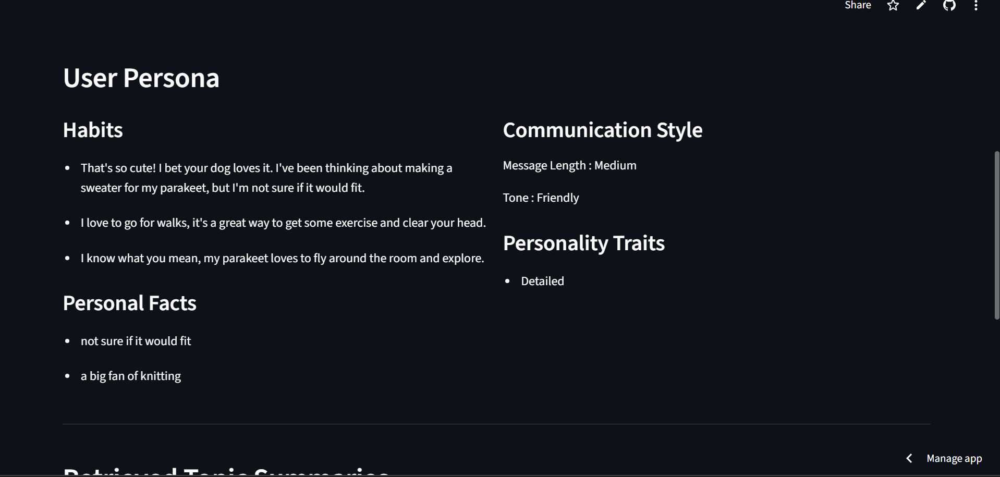
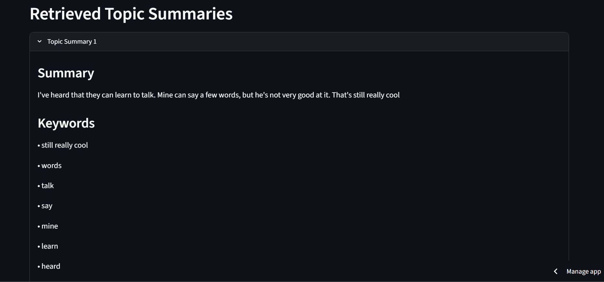
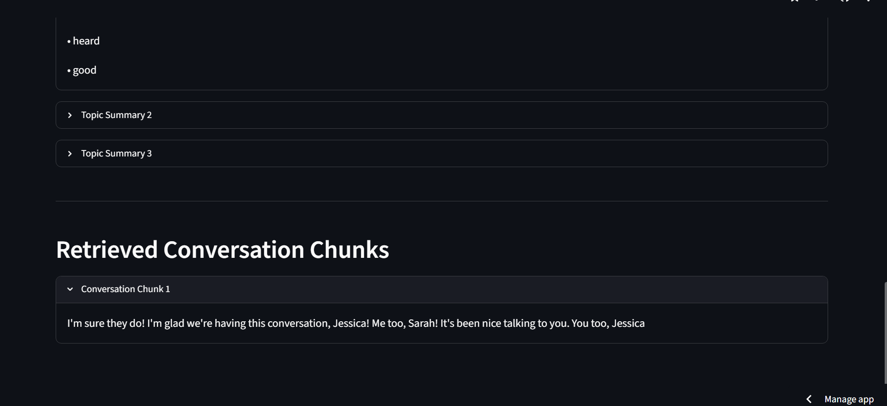

# Conversation Intelligence System

## Overview

This project implements an offline Retrieval-Augmented Generation (RAG) system for analyzing conversations. The system processes conversations chronologically, detects topic changes, generates topic summaries and checkpoints, extracts user personas, and answers user queries using semantic retrieval.

---

# How Topic Changes are Detected

The system processes each conversation in chronological order while preserving the original message sequence.

Instead of treating the entire conversation as a single topic, the conversation is divided into fixed-size windows of **5 consecutive messages**.

Each window is converted into a semantic embedding using the Sentence Transformer model:

```
all-MiniLM-L6-v2
```

The cosine similarity between consecutive windows is then computed.

- If the similarity is **greater than or equal to 0.40**, both windows are considered part of the same topic.
- If the similarity falls **below 0.40**, it indicates a semantic shift, and a new topic checkpoint is created.

Each detected topic stores:

- Conversation ID
- Topic ID
- Start Message ID
- End Message ID
- Topic Summary
- Keywords
- Original Messages

This approach enables automatic topic segmentation based on semantic meaning rather than fixed message counts.
---

# How Retrieval Works

The system follows a Retrieval-Augmented Generation (RAG) pipeline.

1. Each topic summary and conversation chunk is converted into a dense embedding using the Sentence Transformer model (`all-MiniLM-L6-v2`).

2. The embeddings are indexed using FAISS for efficient semantic similarity search.

3. When a user submits a query:
   - The query is embedded using the same Sentence Transformer model.
   - FAISS retrieves the most semantically similar topic summaries and conversation chunks.
   - Retrieved information is combined with persona information when required.

4. The Answer Generator formats the retrieved information into the final response presented in the chatbot.

Using both topic summaries and conversation chunks allows the system to answer questions using both high-level context and detailed conversational information.
---

# How Persona is Built

The persona is generated by analyzing all conversations associated with a user.

The system extracts four categories of information:

- **Habits** – recurring activities, routines, and preferences.
- **Personal Facts** – occupation, relationships, pets, travel, and important events.
- **Personality Traits** – inferred from repeated conversational behavior and language patterns.
- **Communication Style** – average message length, conversational tone, and emoji usage.

The extracted information is stored in a structured JSON file and reused by the chatbot to answer persona-related questions.
---

# Technologies Used

- Python
- Streamlit
- Sentence Transformers
- FAISS
- Transformers
- PyTorch
- Sumy
- RAKE-NLTK
- NLTK

---

# Running the Project

Install dependencies

```bash
pip install -r requirements.txt
```

Run the preprocessing pipeline

```bash
python build_pipeline.py
python test_chunker.py
python test_embeddings.py
python test_persona.py
```

Launch the application

```bash
streamlit run app.py
```

---

# Screenshots


## Chatbot Response


---

## User Persona




---

## Retrieved Topic Summaries




---
## Retrieved Chunk Summaries


---
# Video Demo

Loom Video:

```
Paste your Loom video link here
```
